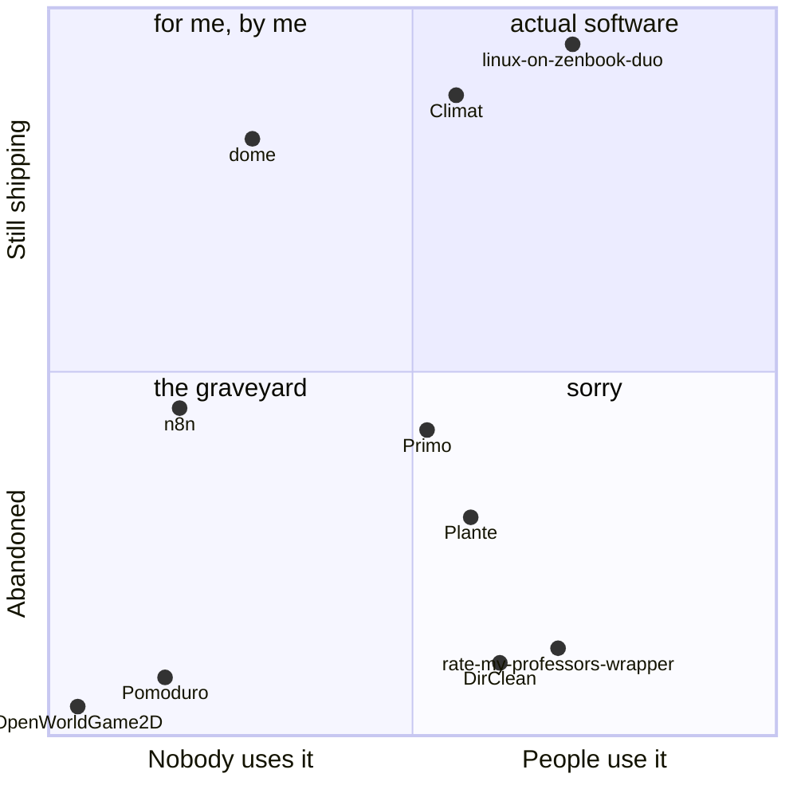

## The machine in question

Drag it.

```stl
solid zenbook-duo
facet normal 0 0 -1
outer loop
vertex -70 -47.5 0
vertex -70 47.5 0
vertex 70 47.5 0
endloop
endfacet
facet normal 0 0 -1
outer loop
vertex -70 -47.5 0
vertex 70 47.5 0
vertex 70 -47.5 0
endloop
endfacet
facet normal 0 0 1
outer loop
vertex -70 -47.5 6
vertex 70 -47.5 6
vertex 70 47.5 6
endloop
endfacet
facet normal 0 0 1
outer loop
vertex -70 -47.5 6
vertex 70 47.5 6
vertex -70 47.5 6
endloop
endfacet
facet normal 0 -1 0
outer loop
vertex -70 -47.5 0
vertex 70 -47.5 0
vertex 70 -47.5 6
endloop
endfacet
facet normal 0 -1 0
outer loop
vertex -70 -47.5 0
vertex 70 -47.5 6
vertex -70 -47.5 6
endloop
endfacet
facet normal 1 0 0
outer loop
vertex 70 -47.5 0
vertex 70 47.5 0
vertex 70 47.5 6
endloop
endfacet
facet normal 1 0 0
outer loop
vertex 70 -47.5 0
vertex 70 47.5 6
vertex 70 -47.5 6
endloop
endfacet
facet normal 0 1 0
outer loop
vertex 70 47.5 0
vertex -70 47.5 0
vertex -70 47.5 6
endloop
endfacet
facet normal 0 1 -0
outer loop
vertex 70 47.5 0
vertex -70 47.5 6
vertex 70 47.5 6
endloop
endfacet
facet normal -1 0 0
outer loop
vertex -70 47.5 0
vertex -70 -47.5 0
vertex -70 -47.5 6
endloop
endfacet
facet normal -1 0 0
outer loop
vertex -70 47.5 0
vertex -70 -47.5 6
vertex -70 47.5 6
endloop
endfacet
facet normal 0 -0.97 0.26
outer loop
vertex -70 72.09 97.76
vertex -70 47.5 6
vertex 70 47.5 6
endloop
endfacet
facet normal 0 -0.97 0.26
outer loop
vertex -70 72.09 97.76
vertex 70 47.5 6
vertex 70 72.09 97.76
endloop
endfacet
facet normal 0 0.97 -0.26
outer loop
vertex -70 77.88 96.21
vertex 70 77.88 96.21
vertex 70 53.3 4.45
endloop
endfacet
facet normal 0 0.97 -0.26
outer loop
vertex -70 77.88 96.21
vertex 70 53.3 4.45
vertex -70 53.3 4.45
endloop
endfacet
facet normal -0 0.26 0.97
outer loop
vertex -70 72.09 97.76
vertex 70 72.09 97.76
vertex 70 77.88 96.21
endloop
endfacet
facet normal 0 0.26 0.97
outer loop
vertex -70 72.09 97.76
vertex 70 77.88 96.21
vertex -70 77.88 96.21
endloop
endfacet
facet normal 1 0 0
outer loop
vertex 70 72.09 97.76
vertex 70 47.5 6
vertex 70 53.3 4.45
endloop
endfacet
facet normal 1 0 0
outer loop
vertex 70 72.09 97.76
vertex 70 53.3 4.45
vertex 70 77.88 96.21
endloop
endfacet
facet normal -0 -0.26 -0.97
outer loop
vertex 70 47.5 6
vertex -70 47.5 6
vertex -70 53.3 4.45
endloop
endfacet
facet normal 0 -0.26 -0.97
outer loop
vertex 70 47.5 6
vertex -70 53.3 4.45
vertex 70 53.3 4.45
endloop
endfacet
facet normal -1 0 0
outer loop
vertex -70 47.5 6
vertex -70 72.09 97.76
vertex -70 77.88 96.21
endloop
endfacet
facet normal -1 0 0
outer loop
vertex -70 47.5 6
vertex -70 77.88 96.21
vertex -70 53.3 4.45
endloop
endfacet
endsolid zenbook-duo
```

## Things I built to avoid doing a thing

| I wanted to | So I built | How it went |
| :--- | :--- | :--- |
| learn AWS | a pomodoro timer | [Pomoduro](https://github.com/JowiAoun/Pomoduro) |
| touch grass | a plant monitor, for indoors | [Plante](https://github.com/JowiAoun/Plante) 🏆🏆 |
| learn piano | a glove that buzzes the correct finger | [Primo](https://github.com/JowiAoun/Primo-Showcase) 🏆 |
| make money | trading algorithms, backtested properly | Sharpe ratio 0.281 💀 [Quant-Development](https://github.com/JowiAoun/Quant-Development) |
| use the second screen on my laptop | the dock policy, hotkeys, backlight and speaker voicing, from scratch | [linux-on-zenbook-duo](https://github.com/JowiAoun/linux-on-zenbook-duo) |
| check the weather | a native weather app, in C++ | [Climat](https://github.com/JowiAoun/clima) |
| know whether a website is a scam | a Chrome extension that asks an LLM | [Surf-Safe](https://github.com/JowiAoun/Surf-Safe) |
| organise my downloads folder | a Bash script, with CI, Docker and pre-commit | [DirClean](https://github.com/JowiAoun/DirClean) |
| stop tabbing out of the terminal | a TUI. then another one. then a third | `tools`, `mc`, `rbx` |

## Where my repositories actually sit



Currently making a laptop that was never meant to run Linux run Linux.

<sub>[Devpost](https://devpost.com/jowiaoun) · [LinkedIn](https://www.linkedin.com/in/jowiaoun/)</sub>
