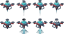
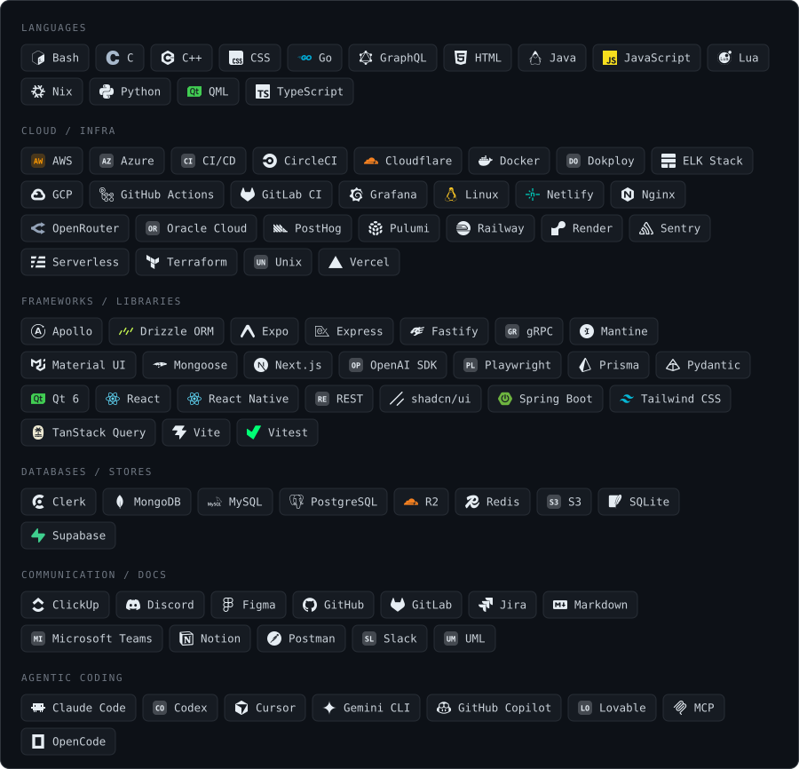

<a href="https://github.com/JowiAoun/linux-on-zenbook-duo">
  
</a>

## Things I built to avoid doing a thing

|  | I wanted to | So I built | How it went |
| :---: | :--- | :--- | :--- |
|  | touch grass | a plant monitor, for indoors | [Plante](https://github.com/JowiAoun/Plante) 🏆🏆 |
|  | learn piano | a glove that buzzes the correct finger | [Primo](https://github.com/JowiAoun/Primo-Showcase) 🏆 |
|  | put out a fire | a swarm of drones, and the simulator to prove they would | [Firefly](https://github.com/JowiAoun/Firefly) 🏆 |
|  | make money | trading algorithms, backtested properly | [Quant-Development](https://github.com/JowiAoun/Quant-Development) |
|  | use the second screen on my laptop | the dock policy, hotkeys, backlight and speaker voicing, from scratch | [linux-on-zenbook-duo](https://github.com/JowiAoun/linux-on-zenbook-duo) |
|  | check the weather | a native weather app, in C++ | [Climat](https://github.com/JowiAoun/clima) |
|  | know whether a website is a scam | a Chrome extension that asks an LLM | [Surf-Safe](https://github.com/JowiAoun/Surf-Safe) |
|  | organise my downloads folder | a Bash script, with CI, Docker and pre-commit | [DirClean](https://github.com/JowiAoun/DirClean) |
|  | learn cloud infra | a pomodoro timer | [Pomoduro](https://github.com/JowiAoun/Pomoduro) |

## Stack



## The setup

Drag it.

```stl
solid jowi-desk
facet normal 0 0 -1
outer loop
vertex -25.24 -33.74 73.5
vertex -48.05 0.09 73.5
vertex 25.24 49.52 73.5
endloop
endfacet
facet normal 0 0 -1
outer loop
vertex -25.24 -33.74 73.5
vertex 25.24 49.52 73.5
vertex 48.05 15.69 73.5
endloop
endfacet
facet normal 0 0 1
outer loop
vertex -25.24 -33.74 76
vertex 48.05 15.69 76
vertex 25.24 49.52 76
endloop
endfacet
facet normal 0 0 1
outer loop
vertex -25.24 -33.74 76
vertex 25.24 49.52 76
vertex -48.05 0.09 76
endloop
endfacet
facet normal 0.56 -0.83 0
outer loop
vertex -25.24 -33.74 73.5
vertex 48.05 15.69 73.5
vertex 48.05 15.69 76
endloop
endfacet
facet normal 0.56 -0.83 0
outer loop
vertex -25.24 -33.74 73.5
vertex 48.05 15.69 76
vertex -25.24 -33.74 76
endloop
endfacet
facet normal 0.83 0.56 0
outer loop
vertex 48.05 15.69 73.5
vertex 25.24 49.52 73.5
vertex 25.24 49.52 76
endloop
endfacet
facet normal 0.83 0.56 0
outer loop
vertex 48.05 15.69 73.5
vertex 25.24 49.52 76
vertex 48.05 15.69 76
endloop
endfacet
facet normal -0.56 0.83 0
outer loop
vertex 25.24 49.52 73.5
vertex -48.05 0.09 73.5
vertex -48.05 0.09 76
endloop
endfacet
facet normal -0.56 0.83 0
outer loop
vertex 25.24 49.52 73.5
vertex -48.05 0.09 76
vertex 25.24 49.52 76
endloop
endfacet
facet normal -0.83 -0.56 0
outer loop
vertex -48.05 0.09 73.5
vertex -25.24 -33.74 73.5
vertex -25.24 -33.74 76
endloop
endfacet
facet normal -0.83 -0.56 0
outer loop
vertex -48.05 0.09 73.5
vertex -25.24 -33.74 76
vertex -48.05 0.09 76
endloop
endfacet
facet normal 0 0 -1
outer loop
vertex -24.55 -30.2 0
vertex -26.92 -26.68 0
vertex -23.4 -24.3 0
endloop
endfacet
facet normal 0 0 -1
outer loop
vertex -24.55 -30.2 0
vertex -23.4 -24.3 0
vertex -21.02 -27.82 0
endloop
endfacet
facet normal 0 0 1
outer loop
vertex -24.55 -30.2 73.5
vertex -21.02 -27.82 73.5
vertex -23.4 -24.3 73.5
endloop
endfacet
facet normal 0 0 1
outer loop
vertex -24.55 -30.2 73.5
vertex -23.4 -24.3 73.5
vertex -26.92 -26.68 73.5
endloop
endfacet
facet normal 0.56 -0.83 0
outer loop
vertex -24.55 -30.2 0
vertex -21.02 -27.82 0
vertex -21.02 -27.82 73.5
endloop
endfacet
facet normal 0.56 -0.83 0
outer loop
vertex -24.55 -30.2 0
vertex -21.02 -27.82 73.5
vertex -24.55 -30.2 73.5
endloop
endfacet
facet normal 0.83 0.56 0
outer loop
vertex -21.02 -27.82 0
vertex -23.4 -24.3 0
vertex -23.4 -24.3 73.5
endloop
endfacet
facet normal 0.83 0.56 0
outer loop
vertex -21.02 -27.82 0
vertex -23.4 -24.3 73.5
vertex -21.02 -27.82 73.5
endloop
endfacet
facet normal -0.56 0.83 0
outer loop
vertex -23.4 -24.3 0
vertex -26.92 -26.68 0
vertex -26.92 -26.68 73.5
endloop
endfacet
facet normal -0.56 0.83 0
outer loop
vertex -23.4 -24.3 0
vertex -26.92 -26.68 73.5
vertex -23.4 -24.3 73.5
endloop
endfacet
facet normal -0.83 -0.56 0
outer loop
vertex -26.92 -26.68 0
vertex -24.55 -30.2 0
vertex -24.55 -30.2 73.5
endloop
endfacet
facet normal -0.83 -0.56 0
outer loop
vertex -26.92 -26.68 0
vertex -24.55 -30.2 73.5
vertex -26.92 -26.68 73.5
endloop
endfacet
facet normal 0 0 -1
outer loop
vertex -42.13 -4.13 0
vertex -44.51 -0.6 0
vertex -40.99 1.77 0
endloop
endfacet
facet normal 0 0 -1
outer loop
vertex -42.13 -4.13 0
vertex -40.99 1.77 0
vertex -38.61 -1.75 0
endloop
endfacet
facet normal 0 0 1
outer loop
vertex -42.13 -4.13 73.5
vertex -38.61 -1.75 73.5
vertex -40.99 1.77 73.5
endloop
endfacet
facet normal 0 0 1
outer loop
vertex -42.13 -4.13 73.5
vertex -40.99 1.77 73.5
vertex -44.51 -0.6 73.5
endloop
endfacet
facet normal 0.56 -0.83 0
outer loop
vertex -42.13 -4.13 0
vertex -38.61 -1.75 0
vertex -38.61 -1.75 73.5
endloop
endfacet
facet normal 0.56 -0.83 0
outer loop
vertex -42.13 -4.13 0
vertex -38.61 -1.75 73.5
vertex -42.13 -4.13 73.5
endloop
endfacet
facet normal 0.83 0.56 0
outer loop
vertex -38.61 -1.75 0
vertex -40.99 1.77 0
vertex -40.99 1.77 73.5
endloop
endfacet
facet normal 0.83 0.56 0
outer loop
vertex -38.61 -1.75 0
vertex -40.99 1.77 73.5
vertex -38.61 -1.75 73.5
endloop
endfacet
facet normal -0.56 0.83 0
outer loop
vertex -40.99 1.77 0
vertex -44.51 -0.6 0
vertex -44.51 -0.6 73.5
endloop
endfacet
facet normal -0.56 0.83 0
outer loop
vertex -40.99 1.77 0
vertex -44.51 -0.6 73.5
vertex -40.99 1.77 73.5
endloop
endfacet
facet normal -0.83 -0.56 0
outer loop
vertex -44.51 -0.6 0
vertex -42.13 -4.13 0
vertex -42.13 -4.13 73.5
endloop
endfacet
facet normal -0.83 -0.56 0
outer loop
vertex -44.51 -0.6 0
vertex -42.13 -4.13 73.5
vertex -44.51 -0.6 73.5
endloop
endfacet
facet normal 0 0 -1
outer loop
vertex 40.99 14.01 0
vertex 38.61 17.53 0
vertex 42.13 19.91 0
endloop
endfacet
facet normal 0 0 -1
outer loop
vertex 40.99 14.01 0
vertex 42.13 19.91 0
vertex 44.51 16.38 0
endloop
endfacet
facet normal 0 0 1
outer loop
vertex 40.99 14.01 73.5
vertex 44.51 16.38 73.5
vertex 42.13 19.91 73.5
endloop
endfacet
facet normal 0 0 1
outer loop
vertex 40.99 14.01 73.5
vertex 42.13 19.91 73.5
vertex 38.61 17.53 73.5
endloop
endfacet
facet normal 0.56 -0.83 0
outer loop
vertex 40.99 14.01 0
vertex 44.51 16.38 0
vertex 44.51 16.38 73.5
endloop
endfacet
facet normal 0.56 -0.83 0
outer loop
vertex 40.99 14.01 0
vertex 44.51 16.38 73.5
vertex 40.99 14.01 73.5
endloop
endfacet
facet normal 0.83 0.56 0
outer loop
vertex 44.51 16.38 0
vertex 42.13 19.91 0
vertex 42.13 19.91 73.5
endloop
endfacet
facet normal 0.83 0.56 0
outer loop
vertex 44.51 16.38 0
vertex 42.13 19.91 73.5
vertex 44.51 16.38 73.5
endloop
endfacet
facet normal -0.56 0.83 0
outer loop
vertex 42.13 19.91 0
vertex 38.61 17.53 0
vertex 38.61 17.53 73.5
endloop
endfacet
facet normal -0.56 0.83 0
outer loop
vertex 42.13 19.91 0
vertex 38.61 17.53 73.5
vertex 42.13 19.91 73.5
endloop
endfacet
facet normal -0.83 -0.56 0
outer loop
vertex 38.61 17.53 0
vertex 40.99 14.01 0
vertex 40.99 14.01 73.5
endloop
endfacet
facet normal -0.83 -0.56 0
outer loop
vertex 38.61 17.53 0
vertex 40.99 14.01 73.5
vertex 38.61 17.53 73.5
endloop
endfacet
facet normal 0 0 -1
outer loop
vertex 23.4 40.08 0
vertex 21.02 43.6 0
vertex 24.55 45.98 0
endloop
endfacet
facet normal 0 0 -1
outer loop
vertex 23.4 40.08 0
vertex 24.55 45.98 0
vertex 26.92 42.45 0
endloop
endfacet
facet normal 0 0 1
outer loop
vertex 23.4 40.08 73.5
vertex 26.92 42.45 73.5
vertex 24.55 45.98 73.5
endloop
endfacet
facet normal 0 0 1
outer loop
vertex 23.4 40.08 73.5
vertex 24.55 45.98 73.5
vertex 21.02 43.6 73.5
endloop
endfacet
facet normal 0.56 -0.83 0
outer loop
vertex 23.4 40.08 0
vertex 26.92 42.45 0
vertex 26.92 42.45 73.5
endloop
endfacet
facet normal 0.56 -0.83 0
outer loop
vertex 23.4 40.08 0
vertex 26.92 42.45 73.5
vertex 23.4 40.08 73.5
endloop
endfacet
facet normal 0.83 0.56 0
outer loop
vertex 26.92 42.45 0
vertex 24.55 45.98 0
vertex 24.55 45.98 73.5
endloop
endfacet
facet normal 0.83 0.56 0
outer loop
vertex 26.92 42.45 0
vertex 24.55 45.98 73.5
vertex 26.92 42.45 73.5
endloop
endfacet
facet normal -0.56 0.83 0
outer loop
vertex 24.55 45.98 0
vertex 21.02 43.6 0
vertex 21.02 43.6 73.5
endloop
endfacet
facet normal -0.56 0.83 0
outer loop
vertex 24.55 45.98 0
vertex 21.02 43.6 73.5
vertex 24.55 45.98 73.5
endloop
endfacet
facet normal -0.83 -0.56 0
outer loop
vertex 21.02 43.6 0
vertex 23.4 40.08 0
vertex 23.4 40.08 73.5
endloop
endfacet
facet normal -0.83 -0.56 0
outer loop
vertex 21.02 43.6 0
vertex 23.4 40.08 73.5
vertex 21.02 43.6 73.5
endloop
endfacet
facet normal 0 0 -1
outer loop
vertex -7.44 -11.48 76
vertex -20.75 8.25 76
vertex 7.44 27.26 76
endloop
endfacet
facet normal 0 0 -1
outer loop
vertex -7.44 -11.48 76
vertex 7.44 27.26 76
vertex 20.75 7.53 76
endloop
endfacet
facet normal 0 0 1
outer loop
vertex -7.44 -11.48 79
vertex 20.75 7.53 79
vertex 7.44 27.26 79
endloop
endfacet
facet normal 0 0 1
outer loop
vertex -7.44 -11.48 79
vertex 7.44 27.26 79
vertex -20.75 8.25 79
endloop
endfacet
facet normal 0.56 -0.83 0
outer loop
vertex -7.44 -11.48 76
vertex 20.75 7.53 76
vertex 20.75 7.53 79
endloop
endfacet
facet normal 0.56 -0.83 0
outer loop
vertex -7.44 -11.48 76
vertex 20.75 7.53 79
vertex -7.44 -11.48 79
endloop
endfacet
facet normal 0.83 0.56 0
outer loop
vertex 20.75 7.53 76
vertex 7.44 27.26 76
vertex 7.44 27.26 79
endloop
endfacet
facet normal 0.83 0.56 0
outer loop
vertex 20.75 7.53 76
vertex 7.44 27.26 79
vertex 20.75 7.53 79
endloop
endfacet
facet normal -0.56 0.83 0
outer loop
vertex 7.44 27.26 76
vertex -20.75 8.25 76
vertex -20.75 8.25 79
endloop
endfacet
facet normal -0.56 0.83 0
outer loop
vertex 7.44 27.26 76
vertex -20.75 8.25 79
vertex 7.44 27.26 79
endloop
endfacet
facet normal -0.83 -0.56 0
outer loop
vertex -20.75 8.25 76
vertex -7.44 -11.48 76
vertex -7.44 -11.48 79
endloop
endfacet
facet normal -0.83 -0.56 0
outer loop
vertex -20.75 8.25 76
vertex -7.44 -11.48 79
vertex -20.75 8.25 79
endloop
endfacet
facet normal 0.54 -0.8 0.26
outer loop
vertex -24.19 13.36 101.99
vertex -20.75 8.25 79
vertex 7.44 27.26 79
endloop
endfacet
facet normal 0.54 -0.8 0.26
outer loop
vertex -24.19 13.36 101.99
vertex 7.44 27.26 79
vertex 3.99 32.37 101.99
endloop
endfacet
facet normal -0.54 0.8 -0.26
outer loop
vertex -25.81 15.76 101.21
vertex 2.37 34.77 101.21
vertex 5.82 29.66 78.22
endloop
endfacet
facet normal -0.54 0.8 -0.26
outer loop
vertex -25.81 15.76 101.21
vertex 5.82 29.66 78.22
vertex -22.37 10.65 78.22
endloop
endfacet
facet normal -0.14 0.21 0.97
outer loop
vertex -24.19 13.36 101.99
vertex 3.99 32.37 101.99
vertex 2.37 34.77 101.21
endloop
endfacet
facet normal -0.14 0.21 0.97
outer loop
vertex -24.19 13.36 101.99
vertex 2.37 34.77 101.21
vertex -25.81 15.76 101.21
endloop
endfacet
facet normal 0.83 0.56 0
outer loop
vertex 3.99 32.37 101.99
vertex 7.44 27.26 79
vertex 5.82 29.66 78.22
endloop
endfacet
facet normal 0.83 0.56 0
outer loop
vertex 3.99 32.37 101.99
vertex 5.82 29.66 78.22
vertex 2.37 34.77 101.21
endloop
endfacet
facet normal 0.14 -0.21 -0.97
outer loop
vertex 7.44 27.26 79
vertex -20.75 8.25 79
vertex -22.37 10.65 78.22
endloop
endfacet
facet normal 0.14 -0.21 -0.97
outer loop
vertex 7.44 27.26 79
vertex -22.37 10.65 78.22
vertex 5.82 29.66 78.22
endloop
endfacet
facet normal -0.83 -0.56 0
outer loop
vertex -20.75 8.25 79
vertex -24.19 13.36 101.99
vertex -25.81 15.76 101.21
endloop
endfacet
facet normal -0.83 -0.56 0
outer loop
vertex -20.75 8.25 79
vertex -25.81 15.76 101.21
vertex -22.37 10.65 78.22
endloop
endfacet
facet normal 0 0 -1
outer loop
vertex 21.29 -49.52 45
vertex 7.98 -29.79 45
vertex 31.94 -13.63 45
endloop
endfacet
facet normal 0 0 -1
outer loop
vertex 21.29 -49.52 45
vertex 31.94 -13.63 45
vertex 45.25 -33.36 45
endloop
endfacet
facet normal 0 0 1
outer loop
vertex 21.29 -49.52 49
vertex 45.25 -33.36 49
vertex 31.94 -13.63 49
endloop
endfacet
facet normal 0 0 1
outer loop
vertex 21.29 -49.52 49
vertex 31.94 -13.63 49
vertex 7.98 -29.79 49
endloop
endfacet
facet normal 0.56 -0.83 0
outer loop
vertex 21.29 -49.52 45
vertex 45.25 -33.36 45
vertex 45.25 -33.36 49
endloop
endfacet
facet normal 0.56 -0.83 0
outer loop
vertex 21.29 -49.52 45
vertex 45.25 -33.36 49
vertex 21.29 -49.52 49
endloop
endfacet
facet normal 0.83 0.56 0
outer loop
vertex 45.25 -33.36 45
vertex 31.94 -13.63 45
vertex 31.94 -13.63 49
endloop
endfacet
facet normal 0.83 0.56 0
outer loop
vertex 45.25 -33.36 45
vertex 31.94 -13.63 49
vertex 45.25 -33.36 49
endloop
endfacet
facet normal -0.56 0.83 0
outer loop
vertex 31.94 -13.63 45
vertex 7.98 -29.79 45
vertex 7.98 -29.79 49
endloop
endfacet
facet normal -0.56 0.83 0
outer loop
vertex 31.94 -13.63 45
vertex 7.98 -29.79 49
vertex 31.94 -13.63 49
endloop
endfacet
facet normal -0.83 -0.56 0
outer loop
vertex 7.98 -29.79 45
vertex 21.29 -49.52 45
vertex 21.29 -49.52 49
endloop
endfacet
facet normal -0.83 -0.56 0
outer loop
vertex 7.98 -29.79 45
vertex 21.29 -49.52 49
vertex 7.98 -29.79 49
endloop
endfacet
facet normal 0 0 -1
outer loop
vertex 21.29 -49.52 49
vertex 19.39 -46.7 49
vertex 43.35 -30.54 49
endloop
endfacet
facet normal 0 0 -1
outer loop
vertex 21.29 -49.52 49
vertex 43.35 -30.54 49
vertex 45.25 -33.36 49
endloop
endfacet
facet normal 0 0 1
outer loop
vertex 21.29 -49.52 96
vertex 45.25 -33.36 96
vertex 43.35 -30.54 96
endloop
endfacet
facet normal 0 0 1
outer loop
vertex 21.29 -49.52 96
vertex 43.35 -30.54 96
vertex 19.39 -46.7 96
endloop
endfacet
facet normal 0.56 -0.83 0
outer loop
vertex 21.29 -49.52 49
vertex 45.25 -33.36 49
vertex 45.25 -33.36 96
endloop
endfacet
facet normal 0.56 -0.83 0
outer loop
vertex 21.29 -49.52 49
vertex 45.25 -33.36 96
vertex 21.29 -49.52 96
endloop
endfacet
facet normal 0.83 0.56 0
outer loop
vertex 45.25 -33.36 49
vertex 43.35 -30.54 49
vertex 43.35 -30.54 96
endloop
endfacet
facet normal 0.83 0.56 0
outer loop
vertex 45.25 -33.36 49
vertex 43.35 -30.54 96
vertex 45.25 -33.36 96
endloop
endfacet
facet normal -0.56 0.83 0
outer loop
vertex 43.35 -30.54 49
vertex 19.39 -46.7 49
vertex 19.39 -46.7 96
endloop
endfacet
facet normal -0.56 0.83 0
outer loop
vertex 43.35 -30.54 49
vertex 19.39 -46.7 96
vertex 43.35 -30.54 96
endloop
endfacet
facet normal -0.83 -0.56 0
outer loop
vertex 19.39 -46.7 49
vertex 21.29 -49.52 49
vertex 21.29 -49.52 96
endloop
endfacet
facet normal -0.83 -0.56 0
outer loop
vertex 19.39 -46.7 49
vertex 21.29 -49.52 96
vertex 19.39 -46.7 96
endloop
endfacet
facet normal 0 0 -1
outer loop
vertex 21.75 -47.16 0
vertex 19.85 -44.34 0
vertex 22.67 -42.44 0
endloop
endfacet
facet normal 0 0 -1
outer loop
vertex 21.75 -47.16 0
vertex 22.67 -42.44 0
vertex 24.57 -45.26 0
endloop
endfacet
facet normal 0 0 1
outer loop
vertex 21.75 -47.16 45
vertex 24.57 -45.26 45
vertex 22.67 -42.44 45
endloop
endfacet
facet normal 0 0 1
outer loop
vertex 21.75 -47.16 45
vertex 22.67 -42.44 45
vertex 19.85 -44.34 45
endloop
endfacet
facet normal 0.56 -0.83 0
outer loop
vertex 21.75 -47.16 0
vertex 24.57 -45.26 0
vertex 24.57 -45.26 45
endloop
endfacet
facet normal 0.56 -0.83 0
outer loop
vertex 21.75 -47.16 0
vertex 24.57 -45.26 45
vertex 21.75 -47.16 45
endloop
endfacet
facet normal 0.83 0.56 0
outer loop
vertex 24.57 -45.26 0
vertex 22.67 -42.44 0
vertex 22.67 -42.44 45
endloop
endfacet
facet normal 0.83 0.56 0
outer loop
vertex 24.57 -45.26 0
vertex 22.67 -42.44 45
vertex 24.57 -45.26 45
endloop
endfacet
facet normal -0.56 0.83 0
outer loop
vertex 22.67 -42.44 0
vertex 19.85 -44.34 0
vertex 19.85 -44.34 45
endloop
endfacet
facet normal -0.56 0.83 0
outer loop
vertex 22.67 -42.44 0
vertex 19.85 -44.34 45
vertex 22.67 -42.44 45
endloop
endfacet
facet normal -0.83 -0.56 0
outer loop
vertex 19.85 -44.34 0
vertex 21.75 -47.16 0
vertex 21.75 -47.16 45
endloop
endfacet
facet normal -0.83 -0.56 0
outer loop
vertex 19.85 -44.34 0
vertex 21.75 -47.16 45
vertex 19.85 -44.34 45
endloop
endfacet
facet normal 0 0 -1
outer loop
vertex 11.29 -31.66 0
vertex 9.39 -28.84 0
vertex 12.21 -26.94 0
endloop
endfacet
facet normal 0 0 -1
outer loop
vertex 11.29 -31.66 0
vertex 12.21 -26.94 0
vertex 14.11 -29.75 0
endloop
endfacet
facet normal 0 0 1
outer loop
vertex 11.29 -31.66 45
vertex 14.11 -29.75 45
vertex 12.21 -26.94 45
endloop
endfacet
facet normal 0 0 1
outer loop
vertex 11.29 -31.66 45
vertex 12.21 -26.94 45
vertex 9.39 -28.84 45
endloop
endfacet
facet normal 0.56 -0.83 0
outer loop
vertex 11.29 -31.66 0
vertex 14.11 -29.75 0
vertex 14.11 -29.75 45
endloop
endfacet
facet normal 0.56 -0.83 0
outer loop
vertex 11.29 -31.66 0
vertex 14.11 -29.75 45
vertex 11.29 -31.66 45
endloop
endfacet
facet normal 0.83 0.56 0
outer loop
vertex 14.11 -29.75 0
vertex 12.21 -26.94 0
vertex 12.21 -26.94 45
endloop
endfacet
facet normal 0.83 0.56 0
outer loop
vertex 14.11 -29.75 0
vertex 12.21 -26.94 45
vertex 14.11 -29.75 45
endloop
endfacet
facet normal -0.56 0.83 0
outer loop
vertex 12.21 -26.94 0
vertex 9.39 -28.84 0
vertex 9.39 -28.84 45
endloop
endfacet
facet normal -0.56 0.83 0
outer loop
vertex 12.21 -26.94 0
vertex 9.39 -28.84 45
vertex 12.21 -26.94 45
endloop
endfacet
facet normal -0.83 -0.56 0
outer loop
vertex 9.39 -28.84 0
vertex 11.29 -31.66 0
vertex 11.29 -31.66 45
endloop
endfacet
facet normal -0.83 -0.56 0
outer loop
vertex 9.39 -28.84 0
vertex 11.29 -31.66 45
vertex 9.39 -28.84 45
endloop
endfacet
facet normal 0 0 -1
outer loop
vertex 40.07 -34.8 0
vertex 38.17 -31.98 0
vertex 40.99 -30.08 0
endloop
endfacet
facet normal 0 0 -1
outer loop
vertex 40.07 -34.8 0
vertex 40.99 -30.08 0
vertex 42.89 -32.9 0
endloop
endfacet
facet normal 0 0 1
outer loop
vertex 40.07 -34.8 45
vertex 42.89 -32.9 45
vertex 40.99 -30.08 45
endloop
endfacet
facet normal 0 0 1
outer loop
vertex 40.07 -34.8 45
vertex 40.99 -30.08 45
vertex 38.17 -31.98 45
endloop
endfacet
facet normal 0.56 -0.83 0
outer loop
vertex 40.07 -34.8 0
vertex 42.89 -32.9 0
vertex 42.89 -32.9 45
endloop
endfacet
facet normal 0.56 -0.83 0
outer loop
vertex 40.07 -34.8 0
vertex 42.89 -32.9 45
vertex 40.07 -34.8 45
endloop
endfacet
facet normal 0.83 0.56 0
outer loop
vertex 42.89 -32.9 0
vertex 40.99 -30.08 0
vertex 40.99 -30.08 45
endloop
endfacet
facet normal 0.83 0.56 0
outer loop
vertex 42.89 -32.9 0
vertex 40.99 -30.08 45
vertex 42.89 -32.9 45
endloop
endfacet
facet normal -0.56 0.83 0
outer loop
vertex 40.99 -30.08 0
vertex 38.17 -31.98 0
vertex 38.17 -31.98 45
endloop
endfacet
facet normal -0.56 0.83 0
outer loop
vertex 40.99 -30.08 0
vertex 38.17 -31.98 45
vertex 40.99 -30.08 45
endloop
endfacet
facet normal -0.83 -0.56 0
outer loop
vertex 38.17 -31.98 0
vertex 40.07 -34.8 0
vertex 40.07 -34.8 45
endloop
endfacet
facet normal -0.83 -0.56 0
outer loop
vertex 38.17 -31.98 0
vertex 40.07 -34.8 45
vertex 38.17 -31.98 45
endloop
endfacet
facet normal 0 0 -1
outer loop
vertex 29.62 -19.3 0
vertex 27.71 -16.48 0
vertex 30.53 -14.58 0
endloop
endfacet
facet normal 0 0 -1
outer loop
vertex 29.62 -19.3 0
vertex 30.53 -14.58 0
vertex 32.43 -17.4 0
endloop
endfacet
facet normal 0 0 1
outer loop
vertex 29.62 -19.3 45
vertex 32.43 -17.4 45
vertex 30.53 -14.58 45
endloop
endfacet
facet normal 0 0 1
outer loop
vertex 29.62 -19.3 45
vertex 30.53 -14.58 45
vertex 27.71 -16.48 45
endloop
endfacet
facet normal 0.56 -0.83 0
outer loop
vertex 29.62 -19.3 0
vertex 32.43 -17.4 0
vertex 32.43 -17.4 45
endloop
endfacet
facet normal 0.56 -0.83 0
outer loop
vertex 29.62 -19.3 0
vertex 32.43 -17.4 45
vertex 29.62 -19.3 45
endloop
endfacet
facet normal 0.83 0.56 0
outer loop
vertex 32.43 -17.4 0
vertex 30.53 -14.58 0
vertex 30.53 -14.58 45
endloop
endfacet
facet normal 0.83 0.56 0
outer loop
vertex 32.43 -17.4 0
vertex 30.53 -14.58 45
vertex 32.43 -17.4 45
endloop
endfacet
facet normal -0.56 0.83 0
outer loop
vertex 30.53 -14.58 0
vertex 27.71 -16.48 0
vertex 27.71 -16.48 45
endloop
endfacet
facet normal -0.56 0.83 0
outer loop
vertex 30.53 -14.58 0
vertex 27.71 -16.48 45
vertex 30.53 -14.58 45
endloop
endfacet
facet normal -0.83 -0.56 0
outer loop
vertex 27.71 -16.48 0
vertex 29.62 -19.3 0
vertex 29.62 -19.3 45
endloop
endfacet
facet normal -0.83 -0.56 0
outer loop
vertex 27.71 -16.48 0
vertex 29.62 -19.3 45
vertex 27.71 -16.48 45
endloop
endfacet
endsolid jowi-desk
```

<sub>[Devpost](https://devpost.com/jowiaoun) · [LinkedIn](https://www.linkedin.com/in/jowiaoun/)</sub>
